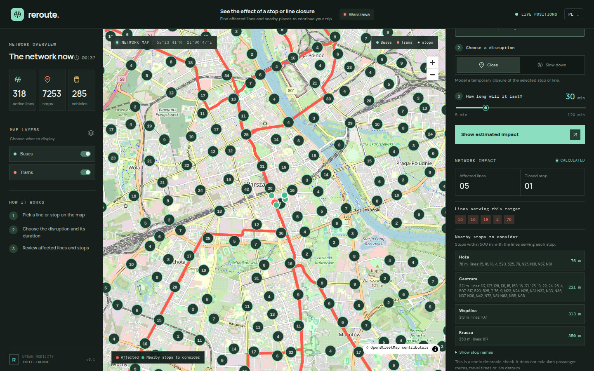
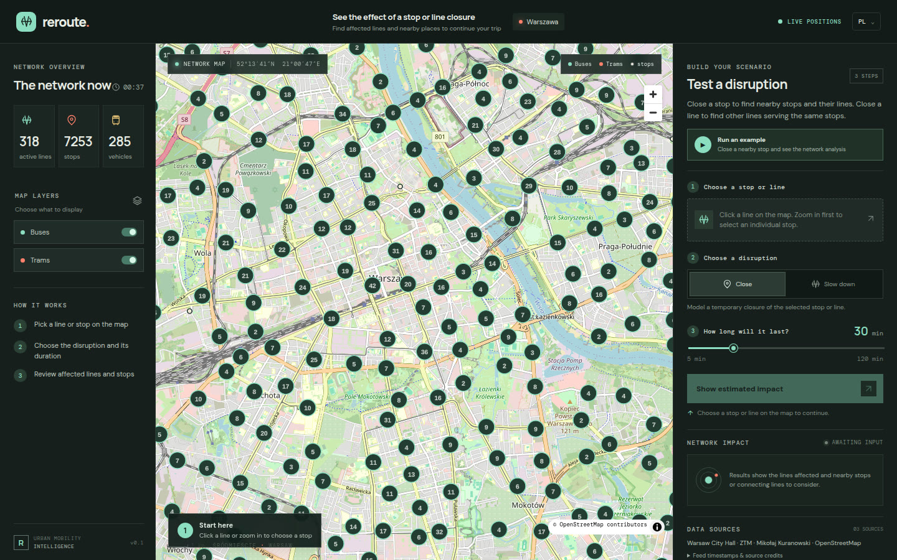
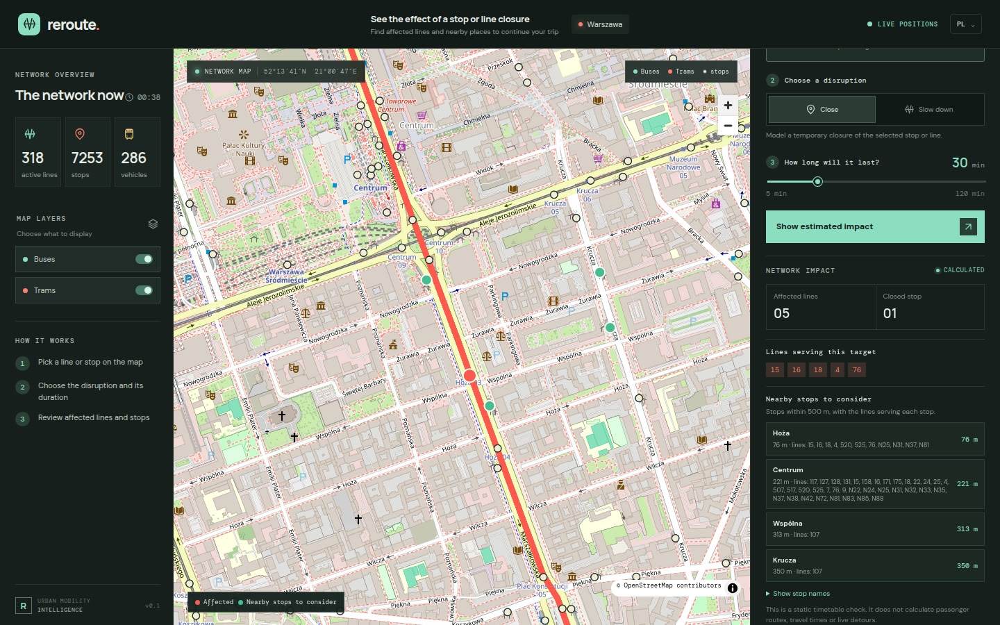
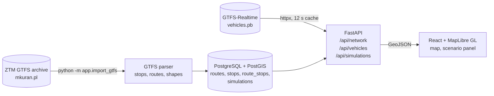

# Reroute

**A local-first Warsaw transit control room: see the bus and tram network with live vehicle positions, then check what a stop or line closure would affect.**

[](https://github.com/MaciejZiel/Reroute/actions/workflows/ci.yml)
[](LICENSE)




## What it does

- **Network map** – Warsaw bus and tram routes and stops from the official ZTM GTFS schedule, drawn with MapLibre (stops clustered at low zoom). A small fictional demo network is built in, so the app works with no import and no credentials.
- **Live vehicles** – positions from the public Warsaw GTFS-Realtime feed, refreshed every 15 seconds in the browser and cached for 12 seconds on the server. If the feed is down, the UI switches to clearly labelled demo vehicles.
- **Disruption check** – pick a stop or a line, choose *close* or *slow down* and a duration (5–120 min). The API returns the affected lines, the affected stops, other lines sharing the same stops, and nearby stops within 500 m with the lines that serve them.
- **Bilingual UI** – Polish and English.

| Network overview | Closure detail |
| --- | --- |
|  |  |

## Architecture



## Tech stack

- **Backend:** Python 3.12, FastAPI, SQLAlchemy 2, GeoAlchemy2, Shapely, httpx, `gtfs-realtime-bindings`
- **Database:** PostgreSQL 16 with PostGIS 3.5
- **Frontend:** React 19, TypeScript, Vite, MapLibre GL, OpenStreetMap tiles
- **Tooling:** pytest, ruff, Docker Compose, GitHub Actions

## Quick start

```bash
cp .env.example .env
docker compose up --build
```

- App: http://localhost:5173
- API docs: http://localhost:8000/docs

The demo network loads on first start. To import the current Warsaw bus and tram timetable (about 100 MB, cached under `data/`; about a minute on a typical connection):

```bash
docker compose exec backend python -m app.import_gtfs
```

Repeat imports reuse the cached archive; pass `--force-download` to fetch the latest version or `--file` to import a local archive. The import replaces only the real network and keeps the demo network as a fallback.

## Tests

```bash
cd backend
uv sync --extra dev        # or: pip install -e '.[dev]'
uv run pytest -q           # 8 tests
uv run ruff check . && uv run ruff format --check .
```

The tests build a small GTFS archive in a temporary directory and stub the HTTP client, so they need neither a database nor network access. They cover GTFS parsing (bus/tram shapes, extended route types, rejecting incomplete archives), the live feed (route mapping, dropping positions outside Warsaw, demo fallback on failure) and the nearby-stop distance logic. CI runs the backend lint and tests plus the frontend type check and build.

## Key technical decisions

- **Demo data first, real data on demand.** A fresh `docker compose up` works offline with a fictional network, and every API response carries `data_mode` (`demo` or `live`) plus a source notice, so the UI can always say what it is showing. The 100 MB GTFS import is an explicit step, and it replaces only non-demo rows.
- **Live feed fetched lazily, with a short shared cache.** Vehicle positions are not stored. The first request after the 12-second cache expires fetches the protobuf feed, behind a lock so concurrent requests don't hit the source twice. This keeps the server stateless and respectful of a free public feed, at the cost of one slower request per refresh.
- **Static network analysis, not routing.** The simulation answers "which lines serve this stop/line and what is nearby" from the timetable graph, and the impact score is simply affected stops × duration. Passenger routing, travel times and real demand are out of scope, and the API notice says so.
- **Cheap geo filtering for nearby stops.** Candidates come from a latitude/longitude bounding box in SQL, then exact haversine distances are computed in Python. With ~7k stops this is fast and easy to unit test. PostGIS geometries are stored for route shapes and stop locations, so the query can move to `ST_DWithin` with a spatial index when needed.

## Limitations / next steps

- Live positions can include stale or ghost vehicles from the source feed; vehicles older than 2 minutes are flagged as stale but still shown.
- The schema is created with `create_all` at startup, with an in-place column type fix; Alembic migrations would replace this.
- The impact score is illustrative, not an official forecast or passenger count. The disruption type (closure or slowdown) is stored with each simulation but does not change the analysis yet.
- Tests cover data parsing and analysis helpers; there are no API-level tests against PostGIS or frontend tests yet.

## Data and attribution

- Warsaw schedules, routes and stops are provided by ZTM Warsaw in GTFS, distributed by Mikołaj Kuranowski: <https://mkuran.pl/gtfs/>. The feed's `attributions.txt` is retained and exposed by the API.
- Live positions are published by Miasto Stołeczne Warszawa and distributed as GTFS-Realtime by Mikołaj Kuranowski: <https://mkuran.pl/gtfs/>. The app displays the feed timestamp and city source link; no API key is required.
- Base map © OpenStreetMap contributors. Map tiles are loaded from `tile.openstreetmap.org`; attribution and caching requirements apply: <https://operations.osmfoundation.org/policies/tiles/>.

Source code, comments and technical documentation are in English.

## License

MIT License, see [LICENSE](LICENSE). Transit data fetched from the GTFS feeds remains subject to the terms of its source.
