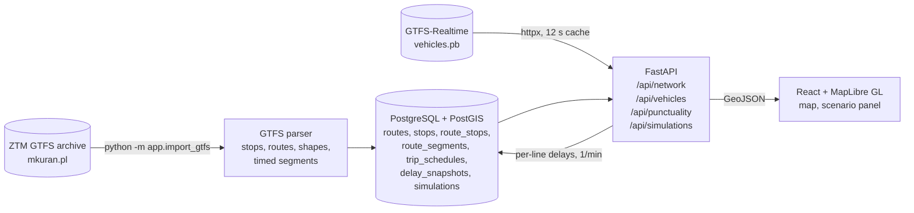

# Reroute

**A local-first Warsaw transit control room: see the bus and tram network with live vehicle positions, then check what a stop or line closure would affect.**

[](https://github.com/MaciejZiel/Reroute/actions/workflows/ci.yml)
[](LICENSE)


## What it does

- **Network map** – Warsaw bus and tram routes and stops from the official ZTM GTFS schedule, drawn with MapLibre (stops clustered at low zoom). A small fictional demo network is built in, so the app works with no import and no credentials.
- **Live vehicles** – positions from the public Warsaw GTFS-Realtime feed, refreshed every 15 seconds in the browser and cached for 12 seconds on the server. If the feed is down, the UI switches to clearly labelled demo vehicles.
- **Disruption check with rerouting** – pick a stop or a line, choose *close* or *slow down* (run times ×1.5/×2/×3) and a duration (5–120 min). A closure removes the stop (all platforms with the same name) or the line from the stop graph; a slowdown stretches its scheduled run times. The API reroutes sample journeys around the disruption with Dijkstra (walking between stops, expected waits and a transfer penalty) and reports the scheduled trips affected during the window, added minutes per journey, the alternative itineraries, other lines sharing the same stops and nearby stops within 500 m.
- **Line punctuality** – each live vehicle reports the GTFS trip it runs; its position is projected onto that trip's stops and compared with the interpolated scheduled time. Per-line summaries (early / on time / late, mean and median delay) are stored at most once a minute and shown as a punctuality chart with a delay trend per line (30 min, 2 h or 6 h window).
- **Bilingual UI** – Polish and English.

| Network overview | Closure detail |
| --- | --- |
|  |  |

## Architecture



## Tech stack

- **Backend:** Python 3.12, FastAPI, SQLAlchemy 2, GeoAlchemy2, Shapely, httpx, `gtfs-realtime-bindings`
- **Database:** PostgreSQL 16 with PostGIS 3.5
- **Frontend:** React 19, TypeScript, Vite, MapLibre GL, OpenStreetMap tiles
- **Tooling:** pytest, ruff, Docker Compose, GitHub Actions

## Quick start

```bash
cp .env.example .env
docker compose up --build
```

- App: http://localhost:5173
- API docs: http://localhost:8000/docs

The demo network loads on first start. To import the current Warsaw bus and tram timetable (about 100 MB, cached under `data/`; 3–4 minutes including the download, mostly spent storing ~270k trip timetables):

```bash
docker compose exec backend python -m app.import_gtfs
```

Delay snapshots are recorded while the map is open. To keep recording without a browser:

```bash
docker compose exec backend python -m app.collect_delays   # one snapshot per minute
```

Repeat imports reuse the cached archive; pass `--force-download` to fetch the latest version or `--file` to import a local archive. The import replaces only the real network and keeps the demo network as a fallback.

## Tests

```bash
cd backend
uv sync --extra dev        # or: pip install -e '.[dev]'
uv run pytest -q           # 26 tests
uv run ruff check . && uv run ruff format --check .
```

The tests build a small GTFS archive in a temporary directory and stub the HTTP client, so they need neither a database nor network access. They cover GTFS parsing (bus/tram shapes, extended route types, rejecting incomplete archives, timed segments on the busiest service day), rerouting on a small fixture network (closure vs. slowdown, transfers, walking, trips in the window), delay estimation against a trimmed recording of the real Warsaw vehicle feed and the matching timetables (`backend/tests/fixtures/`), service days after midnight, the live feed (route mapping, dropping positions outside Warsaw, demo fallback on failure) and the nearby-stop distance logic. CI runs the backend lint and tests plus the frontend type check and build.

## Performance

Measured on the full Warsaw network (318 bus and tram lines, 7,253 stops, 20,164 timed segments; feed of 9 Oct 2026) with the stack running in Docker Compose on a 16-thread laptop, using `backend/scripts/benchmark_api.py --runs 60 --seed 7` (random stops and lines from the network, closures and slowdowns alternating, 30 min):

| Request | Before (`main` at #3) p50 / p95 | After p50 / p95 |
| --- | --- | --- |
| `POST /api/simulations`, stop | 397 / 487 ms | 30 / 84 ms |
| `POST /api/simulations`, line | 465 / 846 ms | 105 / 483 ms |
| `POST /api/simulations`, all | 416 / 756 ms | 59 / 442 ms |
| `GET /api/network` | 731 ms, 10.5 MB | 65 ms, 2.4 MB gzip |

What changed:

- **Graph cache.** The stop graph (stops, segments, ~55k walking links from a lat/lon grid) took ~0.35 s to load and build on every request. It is now built once per data mode and timetable version (`feed_metadata.downloaded_at`), so a re-import invalidates it; the first query after start-up still pays ~0.5 s.
- **Search reuse and bounds.** Undisrupted searches are cached per origin and target set (the graph is immutable), edges are pre-grouped per stop and line, and a disrupted search stops one hour past the usual journey time instead of sweeping the city for unreachable stops.
- **Network response.** The 10.5 MB GeoJSON is serialised and gzipped once per timetable instead of on every page load.
- **Index.** `route_stops(stop_id)` for the "lines at these stops" lookups (the primary key starts with `route_id`).

The remaining cost is pure-Python Dijkstra: closing a long line samples up to eight journeys of 30–60 min across the city, and each search settles several thousand states.

## Key technical decisions

- **Demo data first, real data on demand.** A fresh `docker compose up` works offline with a fictional network, and every API response carries `data_mode` (`demo` or `live`) plus a source notice, so the UI can always say what it is showing. The 100 MB GTFS import is an explicit step, and it replaces only non-demo rows.
- **Live feed fetched lazily, with a short shared cache.** Vehicle positions are not stored. The first request after the 12-second cache expires fetches the protobuf feed, behind a lock so concurrent requests don't hit the source twice. This keeps the server stateless and respectful of a free public feed, at the cost of one slower request per refresh.
- **Shortest paths on a route-expanded stop graph.** The importer keeps one *segment* per pair of consecutive stops of a route, with the mean scheduled run time and the number of trips on the busiest service day of the feed. A search state is "at stop S" or "on line L at stop S", so boarding can carry an expected wait (half the headway, 1–15 min) plus a 2-minute transfer penalty, and walking links stops within 400 m (×1.3 street detour at 1.2 m/s). A closure deletes the affected segments, a slowdown multiplies their run times, and plain Dijkstra with an early exit once all targets are settled is fast enough (a few ms per origin on the 7k-stop network). Journeys are sampled per affected line and direction: two stops either side of a closed stop, or five evenly spaced stops along a closed line. There is no demand data, so "added minutes" are per journey, not passenger-weighted.
- **Delays from positions, not from a predictions feed.** The Warsaw feed publishes positions with trip ids but no delays, so the delay is the feed timestamp minus the scheduled time interpolated at the vehicle's projection onto the trip's stop-to-stop lines. The service day is whichever of today/yesterday gives the smaller delay (GTFS times can exceed 24:00). Vehicles more than 250 m from their trip, standing at the first stop (layover) or outside −15…+90 min are skipped. Trip timetables are stored compactly: ~1,900 shared stop patterns plus one comma-separated departures string per trip (~80 MB in PostgreSQL for ~270k trips). Only per-line aggregates are kept, for 7 days.
- **Cheap geo filtering for nearby stops.** Candidates come from a latitude/longitude bounding box in SQL, then exact haversine distances are computed in Python. With ~7k stops this is fast and easy to unit test. PostGIS geometries are stored for route shapes and stop locations, so the query can move to `ST_DWithin` with a spatial index when needed.

## Limitations / next steps

- Live positions can include stale or ghost vehicles from the source feed; vehicles older than 2 minutes are flagged as stale but still shown.
- Delay estimates use straight lines between stops rather than the route shape, so a vehicle on a winding section can be placed slightly off; stop dwell times are not modelled. Snapshots are only taken while someone has the map open or `collect_delays` runs, and the demo network shows a clearly labelled fictional punctuality history.
- The schema is created with `create_all` at startup, with an in-place column type fix; Alembic migrations would replace this.
- Results are timetable estimates, not an official forecast or passenger count: there is no demand data, departures are averaged into a headway (no exact connection times), and a closed line is assumed to have no replacement service. The legacy impact score (affected stops × duration) is still returned for compatibility.
- Tests cover data parsing and analysis helpers; there are no API-level tests against PostGIS or frontend tests yet.

## Data and attribution

- Warsaw schedules, routes and stops are provided by ZTM Warsaw in GTFS, distributed by Mikołaj Kuranowski: <https://mkuran.pl/gtfs/>. The feed's `attributions.txt` is retained and exposed by the API.
- Live positions are published by Miasto Stołeczne Warszawa and distributed as GTFS-Realtime by Mikołaj Kuranowski: <https://mkuran.pl/gtfs/>. The app displays the feed timestamp and city source link; no API key is required. The test fixtures contain a short trimmed recording of this feed and the matching ZTM timetables, with the same attribution.
- Base map © OpenStreetMap contributors. Map tiles are loaded from `tile.openstreetmap.org`; attribution and caching requirements apply: <https://operations.osmfoundation.org/policies/tiles/>.

Source code, comments and technical documentation are in English.

## License

MIT License, see [LICENSE](LICENSE). Transit data fetched from the GTFS feeds remains subject to the terms of its source.
